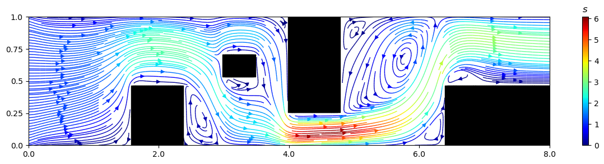

# Navier-Stokes Simulation

This project contains a Python module `navierstokes.py` that simulates fluid dynamics using the Navier-Stokes equations.  For information regarding the overall methodogoly consult the [report](docs/report.pdf). 

## Purpose

The purpose of this module is to provide a numerical solution to the Navier-Stokes equations, which describe the motion of fluid substances such as liquids and gases. This simulation can be used for educational purposes, research, or to visualize fluid flow in various scenarios.

## Usage

To use the module, import the `NavierStokesSolver` class and create an instance with the desired parameters. Then, call the `solve` method to run the simulation and the `plot` method to visualize the results.

```python
from navierstokes import NavierStokesSolver

# Set parameters
solver = NavierStokesSolver(L_x=1, L_y=1, n_rows=100, n_cols=100, Re=100)

# Run simulation
u, u_err, v, v_err, p, p_err = solver.solve(objective='m')

# Visualize result
solver.plot(objective='u')
```

## Parameters

### NavierStokesSolver Class

- `scheme`: Numerical scheme to use (`"central_difference"`, `"upwind"`, `"hybrid"`).
- `L_x`: Length of the domain in the x-direction.
- `L_y`: Length of the domain in the y-direction.
- `n_rows`: Number of rows in the grid.
- `n_cols`: Number of columns in the grid.
- `gamma`: Diffusion coefficient.
- `u`: Initial velocity field (tuple of functions or numbers). If `u=None`, the solver will compute the velocity and pressure fields.
- `phi_B`: Boundary conditions for the scalar field (tuple of values or `None` for homogeneous Neumann).
- `u_B`: Boundary conditions for the u-velocity (tuple of values or `None` for homogeneous Neumann).
- `v_B`: Boundary conditions for the v-velocity (tuple of values or `None` for homogeneous Neumann).
- `p_B`: Boundary conditions for the pressure field (tuple of values or `None` for homogeneous Neumann).
- `kinematic_viscosity`: Kinematic viscosity of the fluid.
- `Re`: Reynolds number.
- `u_char`: Characteristic velocity.
- `mass_density`: Mass density of the fluid.
- `alpha_m`: Under-relaxation factor for momentum equations.
- `alpha_p`: Under-relaxation factor for pressure correction.
- `obstacle_coords`: List of tuples representing obstacles, each tuple is of the form `((x1, y1), (x2, y2))`.

## Method

The solver uses a collocated SIMPLE (Semi-Implicit Method for Pressure-Linked Equations) method. If `u=None` is passed, it solves for the velocity and pressure fields. If `u` is provided, it solves for the scalar primitive \(\phi\) utilizing the boundary conditions for \(\phi\).

## Example

Here is an example of how to run the script and visualize the results:

```python
import matplotlib.pyplot as plt
from navierstokes import NavierStokesSolver

# Set parameters
solver = NavierStokesSolver(
    L_x=1, L_y=1, n_rows=100, n_cols=100, Re=100,
    u_B=(1, None, None, None),  # Dirichlet condition on the east boundary, Neumann elsewhere
    obstacle_coords=[((0.4, 0.4), (0.6, 0.6))]  # Obstacle in the center
)

# Run simulation
u, u_err, v, v_err, p, p_err = solver.solve(objective='m')

# Visualize result
solver.plot(objective='u')
```

## Additional Example

To generate an example figure, use the following code:

```python
from navierstokes import NavierStokesSolver

n8 = NavierStokesSolver(
    u=None, n_cols=240, n_rows=30,
    L_x=8,
    L_y=1,
    Re=100, 
    alpha_m=0.7, 
    alpha_p=0.3, 
    scheme='upwind', 
    obstacle_coords=[((0.2 * 8,0), (0.3 * 8, 0.5)), ((3,0.5), (3.5, 0.75)), ((0.5 * 8,0.25), (0.6 * 8, 1)), ((0.8 * 8, 0), ( 8, 0.5))],
    u_B=(None,1,0,0), 
    v_B=(None, 0,0,0),
    p_B=(0, None, None, None),
    phi_B = (10, 100, 100, None)
)

n8.solve('m', threshold=1e-4)
n8.plot(objective='u', save=True, name='figures/extra.png')
```



For more details, refer to the comments and documentation within the `navierstokes.py` script.
